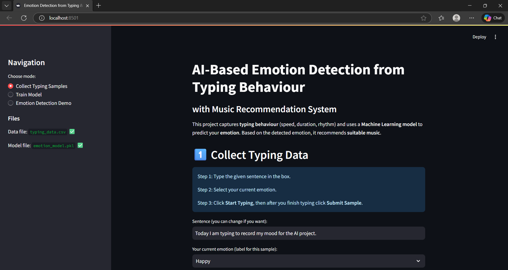

# 🎵 AI-Based Emotion Detection & Music Recommendation System

## 📌 Overview
This project detects a user’s emotional state based on typing behaviour and recommends suitable music accordingly.
It uses basic Machine Learning techniques and a simple, explainable pipeline.

This is an **educational / internship-level project**, not a production AI system.

---

## 🧠 How It Works
1. User typing behaviour data is collected (speed, duration, patterns).
2. Features are processed and passed to a trained ML model.
3. The model predicts the emotion (Happy, Sad, Angry, Calm).
4. Music is recommended based on the predicted emotion.

---

## 🚀 Features
- Emotion detection using Machine Learning
- Random Forest classifier
- Simple and interpretable logic
- Music recommendation based on emotion
- Streamlit-based user interface

---

## 🛠️ Technologies Used
- Python
- Streamlit
- Pandas
- NumPy
- Scikit-learn
- Joblib

---

## 📂 Project Structure
AI-based-emotion-detection-music-recommendation/
│
├── app.py
├── README.md
├── requirements.txt
│
├── data/
│ └── typing_data.csv
│
├── model/
│ └── emotion_model.pkl
│
├── screenshots/
│ ├── ui.png
│ └── result.png
│
└── .github/


---


---

## ⚙️ How to Run the Project
```bash
pip install -r requirements.txt
streamlit run app.py
## 📸 Screenshots

### Application Interface


### Emotion Detection & Music Recommendation

